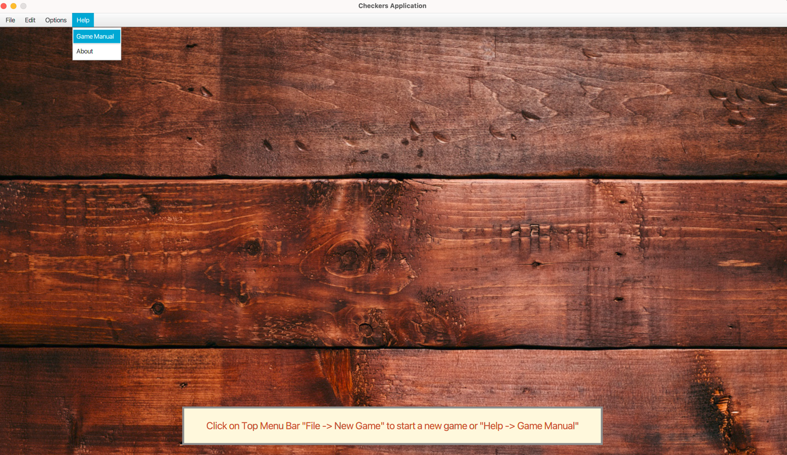
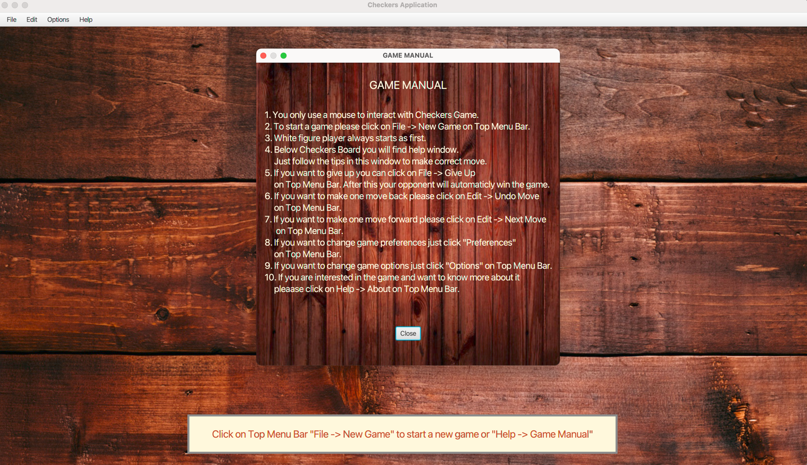
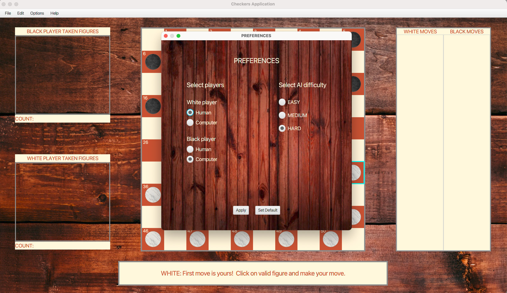
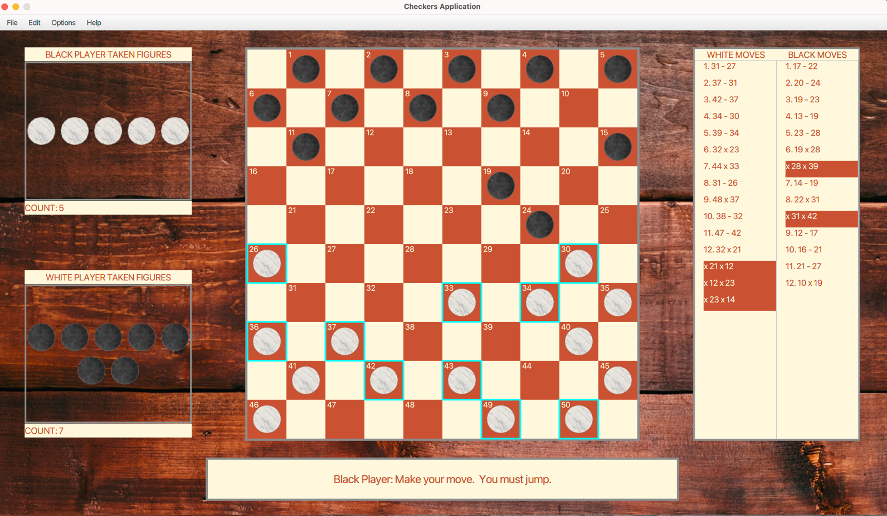
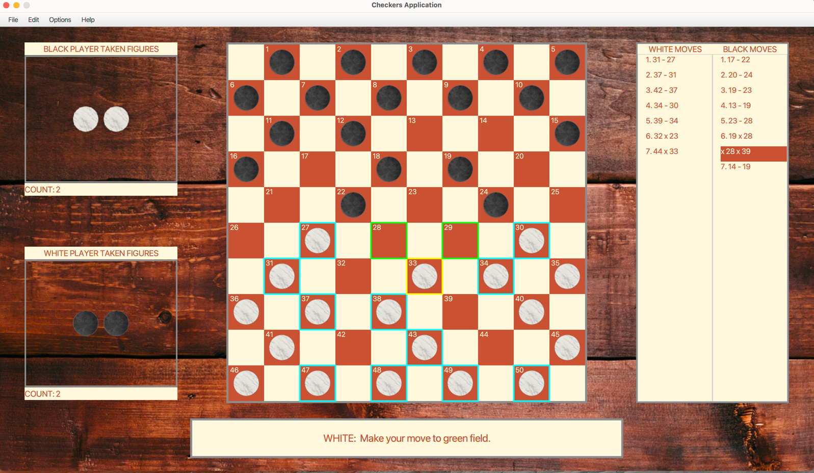
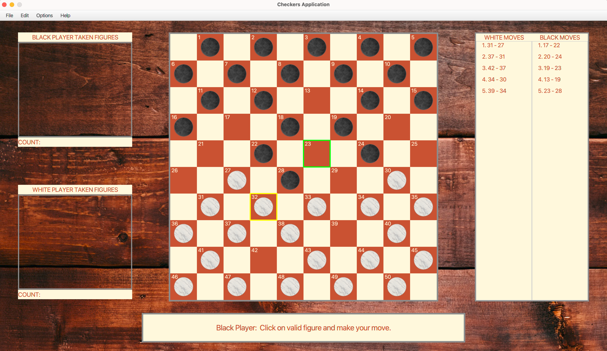
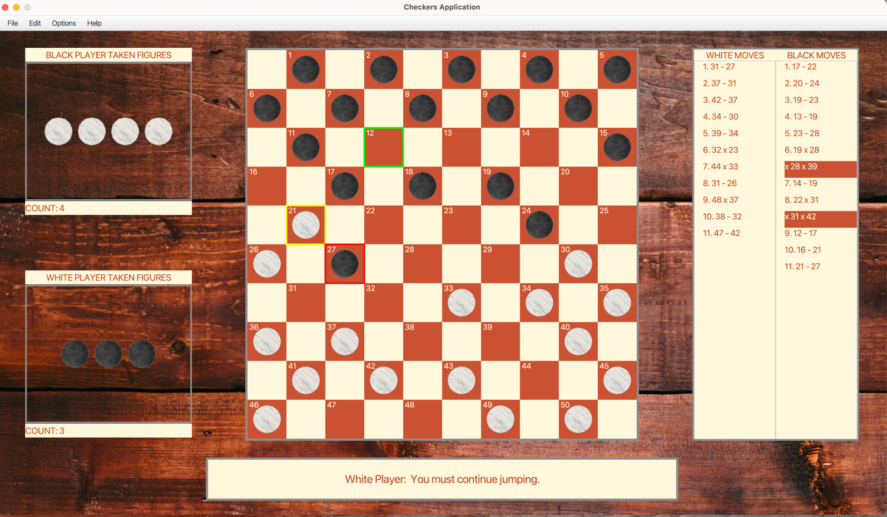
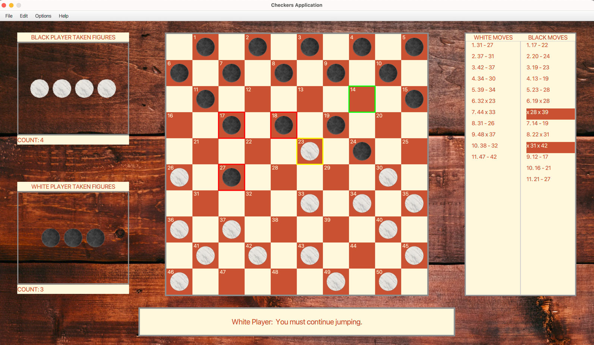
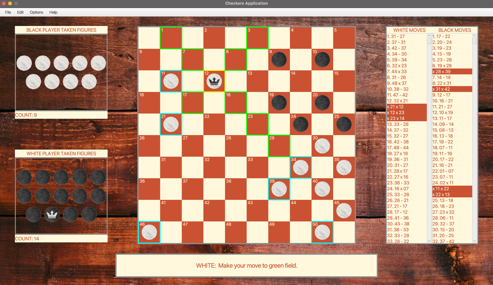
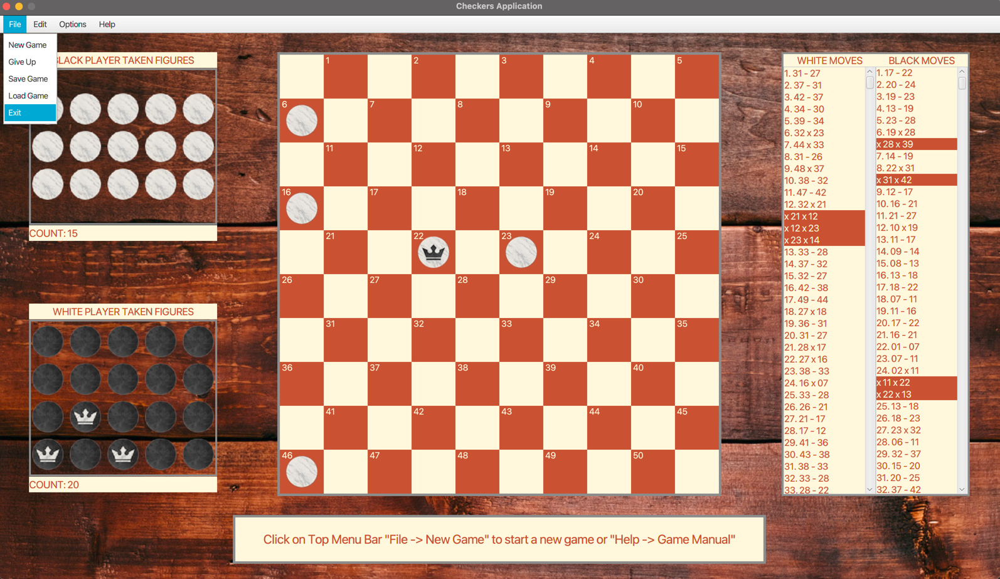

# Checkers Game

## Table of contents

* [Introduction](##Introduction)
* [Gameplay](##Gameplay)
* [Technology](##Technology)

## Introduction

Game is a variation of checkers, which is called Polish Checkers or International Checkers. Game has implemented logic
that accurately reproduces the real tournament game of checkers. More information about game you will find on:

https://en.wikipedia.org/wiki/International_draughts\

Game has implemented levels of difficulty by creating simple artificial intelligence of computer opponent based on
MinMax algorithm (MEDIUM and HARD level of difficulty) and for EASY difficulty uses java.util.Random class.

This project was generated with java jdk-11.0.7 LTS version with Gradle and JavaFX 11.0.2 libraries.

To run application just make few steps:

1. Clone repository to some directory on your computer.
2. First option - Run executable Launcher class from your IDE like Eclipse or InteliJ IDEA.
3. Second option - for Windows system open run.bat file using windows command line.
4. Second option - for UNIX system open run.sh file using terminal (grant proper privileges if needed).

## Gameplay

#### In the game You can:

* Firstly from top menu bar you can choose by mouse File, Edit, Options or Help. I recommend to start from Help and
  choose Game Manual as from screen below.

* After left click by mouse GAME MANUAL will appear as on screen below.

* After you read GAME MANUAL left click on File -> New Game to start. Game PREFERENCES panel on screen below will
  appear:

    * Choose Human or computer player and set IA difficulty. Possibilities you can choose:

      - Human (White Player) vs Human (Black Player),
      - Computer (White Player) vs Human (Black Player),
      - Computer (White Player) vs Computer (Black Player).

        You can reverse colours as you want of course :)

* After you set players your game finally starts, remember that all the time game will give you hints in center bottom
  panel. On screen below you can see how game looks. Let's shortly describe main view of it on below picture:

    1. On the left side you will see black and white players taken figure plains. If you or your opponent will capture a
       figure, then beaten figure will be moved to the appropriate pane,

    2. On the right side you will see game move log like in tournament game. Notation 17-22 means that player make
       normal move from field 17 to field 22. Notation 19x28 means that player make attack move (capture a figure) from
       field 19 to 28 (on screen yoy will find brown field after 19x28 attack move with notation x28x39 it means that
       chain of attack happens after first capture).

    3. In the center you will see main checkers board with pawns for entire game you will use only mouse to control the
       game.

    4. On center bottom panel you will see hint messages entire time through gameplay.

* Steps you need to do if you want to make a move on screen below:

    1. Using mouse left click on figure that you want to move (game will sign figures with valid move by CYAN colour square)
    2. After first step game will sign chosen figure by a YELLOW square and possible moves by GREEN squares (possible move
      that current figure can make).
    3. To make a move just left click on GREEN square. Your figure will make a move and turn will change to the opponents.

* Steps you need to do if you want to make a attack move on screen below:

    1. Attack move will appear automaticly when your opponent will make a move in your figure attack field. In that 
       case game will automaticly sellect your figure as yellow square and show you possible ways to beat enemy figure by GREEN square.
    2. If you have more than one figure that can beat enemy figure in one time you can choose which one will beat enemy figure.
    3. To make a attack move just left click on GREEN square. Your figure will make a attack move and turn will change to the opponents.

* Steps you need to do if you want to make a chain attack move on screen below:

    1. If you have opportunity after first attack move to make another one game will supports you and shows you another possibilities
       to make attack move by signing jumped figures as RED square and as GREEN square position that you can move to. 
    2. To make another attack move just left click on GREEN square. Your figure will make a attack and if it is a possibility 
       to make another attack move game will support you as in first step till the end of the attack chain and when its over then turn will change to the opponents.

* Screen below shows chaining attack:

* After a chain of attack game will clear captured figures, put it to the TAKEN FIGURES plain, update MOVE logs:

* When queen appears on board normal movement, attack movement or chaining attack movement mechanics will be exactly the
  same as for pawns you just have bigger range of movement that you can make and possibilities to chain attack by
  'flying queen' :)

* After game ends you can a left click on File and choose New Game to start another game or Exit to close application.
  During game when you play against opponent, and you don't want to continue, you can finish current game by left
  clicking on Give Up.

* Play with your friends or computer opponent and ENJOY IT :)

## Technology

- Java 11
- JUnit
- Gradle
- JavaFX
